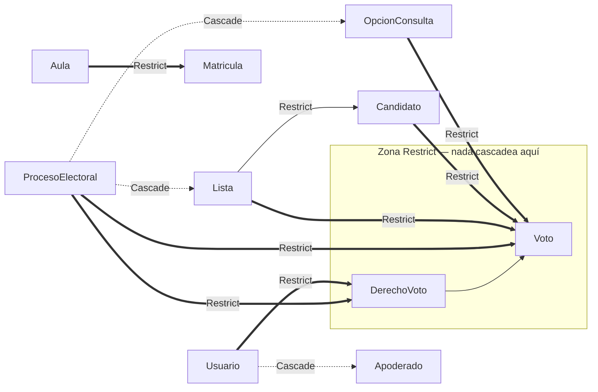

# Diseño: base-schema-and-migrations (Backlog #2 — Esquema base y migraciones)

Este documento cierra el nivel que la propuesta y la spec dejaron abierto: la semántica de borrado de
cada relación, cómo viaja el SQL raw dentro de las migraciones de Prisma, cómo los tests alcanzan un
Postgres real reutilizando el fixture de #1, dónde caen las fronteras de los cuatro grupos de
migración y la forma exacta de las columnas de elección de `Voto`.

**Bloqueo duro vigente.** Este change no puede llegar a `sdd-apply` hasta que el Backlog #1
(`system-scaffolding`) esté implementado: `apps/backend`, Prisma instalado con su migración baseline
vacía (tarea 1.14 de #1), el Postgres de Docker Compose y el fixture de Postgres de CI (Fase 5 y 7
de #1) son prerrequisitos estructurales. Todo lo que sigue está escrito para el mundo en que #1 ya
aterrizó, y se apila sobre su baseline sin modificarla.

## Enfoque técnico

Primero el DSL de Prisma; el SQL raw se agrega **a mano al final del mismo `migration.sql`** que crea
la tabla a la que pertenece, de modo que `prisma migrate deploy` siga siendo atómico por tabla. Como
`schema.prisma` no puede representar un índice parcial ni un `CHECK`, la coherencia entre intención
y SQL aplicado no descansa en comentarios: descansa en dos verificaciones automáticas (deriva del
lado DSL en CI, aserciones de catálogo `pg_constraint`/`pg_indexes` en la suite) más los tests de
rechazo que la spec exige.

Las migraciones corren con el rol `seei_migrator` y **los tests se conectan con `seei_app`**
(`DATABASE_URL`). Esto reejercita gratis los privilegios por defecto que #1 estableció (D5 de su
diseño): si `ALTER DEFAULT PRIVILEGES` no cubriera las tablas nuevas, la suite falla de inmediato.

### Convención de nombres

Tablas y modelos en `PascalCase` **sin diacríticos ni `ñ`** (`AnioEscolar`, `Seccion`, `Matricula`,
`OpcionConsulta`, `Configuracion`), siguiendo el precedente literal `"EventoAuditoria"` que #1 ya fijó
en su `REVOKE` preparatorio. Columnas en `snake_case` declaradas así en el DSL (sin `@@map`), para que
cliente y base compartan un único nombre. PK `String @id @default(uuid()) @db.Uuid` en todas las
tablas. Índices y restricciones creados a mano llevan nombre explícito, porque los tests los asertan
por nombre.

## Resumen de decisiones

| # | Decisión | Alternativas descartadas | Fundamento |
|---|---|---|---|
| D1 | `Restrict` por omisión en todo el esquema; `Cascade` solo en composición pura de un padre borrable en `borrador`; `SetNull` en ningún lugar | `Cascade` en el árbol académico; `SetNull` en las FK de elección de `Voto` | Ningún camino de borrado puede alcanzar `DerechoVoto` ni `Voto` (ADR-0010, ADR-0003); el árbol académico es el insumo histórico del padrón |
| D2 | SQL raw agregado a mano al final del `migration.sql` generado por `--create-only`; deriva detectada por doble verificación | Migración separada solo-SQL; `prisma migrate diff --exit-code`; comentario `// NOTE:` como única garantía | `diff --exit-code` falla siempre (ve el SQL raw como sobrante frente al datamodel); un archivo por tabla mantiene `deploy` atómico |
| D3 | Proyecto Jest `test:schema` sobre el fixture de #1; `pg` crudo para restricciones SQL raw, Prisma Client para las de DSL | Testcontainers; segundo fixture; asertar todo vía Prisma | La spec exige `23505`/`23514` literales; `pg` los expone verbatim, Prisma normaliza y su mapeo de errores no-únicos no es contrato estable |
| D4 | Se confirman los cuatro grupos de migración; se entregan en **cinco** PR (un PR 0 de arnés, sin migración) | Cuatro PR; cinco migraciones | La spec exige exactamente cuatro migraciones; el arnés no es una migración y separarlo deja el grupo mayor en ~290 líneas autoradas |
| D5 | Tres FK nulables + `blanco Boolean NOT NULL DEFAULT false`, con `CHECK (num_nonnulls(...) + blanco::int = 1)` | `blanco` nulable; columna discriminadora `tipo_eleccion`; suma de `::int` | Un `blanco` nulable vuelve `NULL` toda la expresión y Postgres **acepta** la fila: el `NOT NULL` es lo que hace exigible el `CHECK` |
| D6 | Una sola tabla de unión `ProcesoAula` como alcance autoritativo | `ProcesoNivel` + `ProcesoGrado` + `ProcesoAula`; arreglo JSON | El padrón hace `JOIN Matricula → Aula`; `DerechoVoto.aula_snapshot` ya congela el alcance efectivo (ADR-0003) |
| D7 | `Configuracion` no lleva ninguna columna de secreto SMTP: solo `smtp_host`, `smtp_puerto`, `smtp_remitente` | `smtp_config JSONB` con credenciales | Cierra el riesgo señalado en la propuesta sin invadir #10: la contraseña vendrá de variable de entorno o gestor de secretos, decisión de #10 |

## D1 — Semántica `onDelete` relación por relación

**Gotcha que obliga a ser explícito:** el valor por omisión de Prisma para una relación **opcional** es
`onDelete: SetNull`. Las tres FK de elección de `Voto` son opcionales. Sin declaración explícita,
borrar una `Lista` pondría `lista_id = NULL` en los votos ya emitidos — convirtiendo un voto válido en
una fila con cero elecciones. Con el `CHECK` presente Postgres aborta con `23514` (error confuso, a
varios pasos de la causa); sin él, la elección se borraría en silencio. Ambos resultados son
inaceptables bajo ADR-0010.

**Regla:** `Restrict` en todo, salvo composición pura cuyo padre solo puede borrarse en estado
`borrador` y desde la cual **ningún camino de cascada alcanza `DerechoVoto` ni `Voto`**. `SetNull` no
se usa en ninguna relación de este esquema. `onUpdate` queda en el `Cascade` por omisión de Prisma:
es inocuo porque las PK son `uuid` generadas y nunca se actualizan.

| Relación | Acción | Fundamento |
|---|---|---|
| `Grado → Nivel`, `Seccion → Grado`, `Seccion → AnioEscolar` | `Restrict` | Vaciar la rama es una acción administrativa explícita de #8, nunca un efecto lateral |
| `Aula → Grado`, `Aula → Seccion`, `Aula → AnioEscolar` | `Restrict` | `Aula` es el eje del cálculo de padrón |
| `Matricula → Usuario`, `→ Aula`, `→ AnioEscolar` | `Restrict` | La matrícula es el registro histórico del que salió cada `DerechoVoto`; borrarla por cascada reescribiría la evidencia del acta |
| `Apoderado → Usuario` (estudiante) | **`Cascade`** | Composición pura del registro del estudiante, nunca referenciada por `DerechoVoto`/`Voto`. El `Restrict` de `Matricula`/`DerechoVoto` ya impide borrar un `Usuario` con historia |
| `Lista → ProcesoElectoral`, `OpcionConsulta → ProcesoElectoral`, `Candidato → ProcesoElectoral`, `ProcesoAula → ProcesoElectoral` | **`Cascade`** | Composición de un proceso descartable en `borrador` (un `borrador` no tiene `DerechoVoto`: el padrón se materializa al abrir) |
| `Candidato → Lista` (`lista_id` nulable) | `Restrict` | El candidato individual existe sin lista; desvincularlo en silencio rompería la boleta |
| `ProcesoAula → Aula` | `Restrict` | Borrar un aula no puede reducir en silencio el alcance de un proceso |
| `DerechoVoto → ProcesoElectoral`, `→ Usuario` | `Restrict` | Padrón congelado (ADR-0003). La retención/anonimización de ADR-0010 es un `UPDATE` administrativo fuera de la aplicación, nunca un `DELETE` |
| `Voto → ProcesoElectoral`, `→ DerechoVoto` | `Restrict` | Un voto emitido no se borra por ningún camino |
| `Voto → Lista`, `→ OpcionConsulta`, `→ Candidato` | `Restrict` **explícito** | Anula el `SetNull` por omisión. La baja de candidato es `estado` + `baja_en`, jamás `DELETE` (TECH-DESIGN, Flujo 4: conserva sus votos) |
| `Acta → ProcesoElectoral`, `JobCorreo → Usuario`, `Configuracion → AnioEscolar` | `Restrict` | Artefactos probatorios y singleton institucional |

**Guardia de doble anillo.** Un `DELETE` sobre un `ProcesoElectoral` con votos falla dos veces: por el
`Restrict` directo de `Voto.proceso_id` y, si alguien intentara borrar solo la `Lista`, por el
`Restrict` de `Voto.lista_id`. El `Cascade` de `Lista → ProcesoElectoral` no lo debilita: Postgres
evalúa la cascada y el `Restrict` interior aborta la transacción completa.



## D2 — Cómo viaja el SQL raw y cómo se detecta la deriva

**Procedimiento de autoría** (por grupo que lleva SQL raw):

1. `pnpm prisma migrate dev --create-only --name <slug>` genera `migration.sql`.
2. Se **anexa a mano** el bloque SQL raw al final de ese mismo archivo, con nombre explícito de objeto.
3. Comentario `// NOTE: restricción en SQL raw dentro de <ruta>/migration.sql` sobre el modelo afectado.
4. Nunca se edita una migración ya aplicada (Prisma verifica checksum) ni se ejecuta `prisma db push`
   (regeneraría el esquema perdiendo el SQL raw).

**Por qué no `prisma migrate diff --exit-code`.** Comparar `--from-migrations` contra
`--to-schema-datamodel` reporta el índice parcial y el `CHECK` como objetos *sobrantes* (existen en las
migraciones, no en el datamodel), de modo que el check fallaría de forma permanente. Es la trampa
obvia y hay que documentarla para que nadie la reintroduzca.

**Verificación en dos capas:**

| Capa | Qué detecta | Mecanismo |
|---|---|---|
| Deriva del lado DSL (CI) | Un modelo cambiado en `schema.prisma` sin su migración | `prisma migrate dev --create-only --name drift_check` contra la shadow DB efímera; si el `migration.sql` resultante **no está vacío**, hay deriva; el directorio se elimina siempre |
| Deriva del lado SQL raw (suite) | El SQL raw perdido al regenerar una migración | Aserciones de catálogo: `SELECT conname, pg_get_constraintdef(oid) FROM pg_constraint WHERE conname = 'voto_eleccion_exactamente_una_chk'` y `SELECT indexdef FROM pg_indexes WHERE indexname = 'anio_escolar_activo_unico_idx'`, más los tests de rechazo conductuales |

```bash
# apps/backend/scripts/check-migration-drift.sh  (job build-and-check, tras migrate deploy)
set -euo pipefail
pnpm prisma migrate dev --create-only --name drift_check --skip-generate
DIR="$(ls -d prisma/migrations/*_drift_check)"
case "$DIR" in *_drift_check) ;; *) echo "ruta inesperada: $DIR"; exit 1 ;; esac
if [ -s "$DIR/migration.sql" ]; then
  echo "Deriva: schema.prisma cambió sin migración. Ejecute 'prisma migrate dev'."
  cat "$DIR/migration.sql"; rm -rf "$DIR"; exit 1
fi
rm -rf "$DIR"
```

**Contingencia verificable durante `sdd-apply`** (mismo patrón que la contingencia de `directUrl` en
#1): si la versión fijada de Prisma **no** genera un archivo cuando no hay diferencias, el script pasa
a comprobar la ausencia del directorio en lugar de su vacuidad. La rama se decide con una ejecución
real, no por supuesto.

## D3 — Arnés de tests de rechazo de restricciones

**Sin segundo fixture.** Se reutiliza exactamente la infraestructura de #1:
`infra/docker/docker-compose.test.yml` (Postgres en `5433`, `tmpfs`) en local, y el service container
`postgres:16` del job `e2e-backend` en CI.

| Elemento | Definición |
|---|---|
| Proyecto Jest | `apps/backend/test/schema/jest-schema.config.ts`, patrón `test/schema/**/*.spec.ts` |
| Script | `pnpm --filter @seei/backend test:schema` |
| Tarea Turborepo | `"test:schema": { "dependsOn": ["^build"], "cache": false, "env": ["DATABASE_URL", "MIGRATION_DATABASE_URL"] }` — `cache: false` por la misma razón que `test:e2e`: un acierto de caché ocultaría una migración no aplicada |
| CI | En el job `e2e-backend`, inmediatamente después de `prisma migrate deploy` y antes de `test:e2e` |
| Conexión | `pg.Client` con `DATABASE_URL` (rol `seei_app`) — `pg` como **devDependency** de `apps/backend` |

**Por qué `pg` crudo para el SQL raw.** La spec exige asertar `23505` y `23514` reales. `pg` los expone
verbatim (`err.code`, `err.constraint`, `err.table`); Prisma envuelve los errores y su mapeo para
violaciones no-únicas no es un contrato público estable entre versiones. Reparto:

- Restricciones de **DSL** (`@@unique([proceso_id, derecho_voto_id])`): se ejercitan con Prisma Client
  y se aserta `e.code === 'P2002'` con `e.meta.target`.
- Restricciones de **SQL raw** (índice parcial, `CHECK`) y **FK**: se ejercitan con `pg` y se aserta
  `{ code, constraint }` exactos.

```ts
// apps/backend/test/schema/helpers/expect-pg-error.ts
export async function expectPgError(
  fn: () => Promise<unknown>,
  esperado: { code: string; constraint?: string },
): Promise<void> {
  try { await fn(); } catch (e) {
    const err = e as { code?: string; constraint?: string };
    expect(err.code).toBe(esperado.code);
    if (esperado.constraint) expect(err.constraint).toBe(esperado.constraint);
    return;
  }
  throw new Error(`Se esperaba ${esperado.code} y la operación fue aceptada`);
}
```

**Aislamiento sin orden implícito.** Una violación aborta la transacción en curso, así que el patrón es
`BEGIN` por test, `SAVEPOINT s` antes de cada intento, `ROLLBACK TO s` después, y `ROLLBACK` en el
`afterEach`. La base queda intacta entre archivos y ningún test depende del anterior.

```mermaid
sequenceDiagram
    autonumber
    participant CI as GitHub Actions
    participant Mig as prisma migrate deploy (seei_migrator)
    participant Pg as postgres:16 (service)
    participant Je as Jest test:schema (seei_app)
    CI->>Mig: aplica baseline #1 + 4 migraciones de #2
    Mig->>Pg: DDL + SQL raw (índice parcial, CHECK)
    CI->>Je: ejecuta la suite
    Je->>Pg: SELECT sobre pg_constraint / pg_indexes
    Pg-->>Je: definiciones por nombre  (falla si el SQL raw se perdió)
    Je->>Pg: SAVEPOINT s; INSERT que debe ser rechazado
    Pg-->>Je: ERROR 23505 / 23514 / 23503
    Je->>Pg: ROLLBACK TO s
```

## D4 — Fronteras de los grupos y peso de revisión

Se confirman los **cuatro grupos** de la propuesta y la spec, sin cambios de frontera. El arnés de D3
no es una migración, así que se entrega como PR 0 autónomo y verde (incluye el auto-test del helper
`expectPgError` contra una tabla temporal), lo que evita empujar el grupo mayor por encima del
presupuesto.

**Regla de conteo:** el `migration.sql` generado por Prisma es un artefacto **generado** (excluido del
conteo autorado de riesgo, incluido en la identidad del snapshot); el bloque SQL raw anexado a mano
**sí** es autorado.

| PR | Migración | Tablas | `schema.prisma` | SQL raw a mano | Seed | Tests | **Autoradas** | Generadas |
|---|---|---|---|---|---|---|---|---|
| 0 | — (arnés) | — | — | — | — | ~110 | **~110** | — |
| 1 | `..._identity_and_academic_tree` | 8 | ~150 | ~6 | ~40 | ~95 | **~290** | ~190 |
| 2 | `..._electoral_process_structure` | 5 | ~110 | 0 | 0 | ~50 | **~160** | ~150 |
| 3 | `..._voting_core` | 2 | ~55 | ~10 | 0 | ~140 | **~205** | ~60 |
| 4 | `..._support_tables` | 3 | ~60 | 0 | ~30 | ~35 | **~125** | ~90 |

Total autorado estimado ~890 líneas. Ningún PR supera 400. El PR 3 es el de mayor valor de revisión
(lleva `0 votos duplicados` y el `CHECK`) y el más pequeño en esquema: conviene revisarlo con máxima
atención. La decisión final del encadenamiento corresponde a `sdd-tasks`.

## D5 — Columnas de elección de `Voto` y expresión exacta del `CHECK`

```prisma
model Voto {
  id                  String   @id @default(uuid()) @db.Uuid
  proceso_id          String   @db.Uuid
  derecho_voto_id     String   @db.Uuid
  lista_id            String?  @db.Uuid
  opcion_id           String?  @db.Uuid
  candidato_id        String?  @db.Uuid
  blanco              Boolean  @default(false)          // NOT NULL — ver nota
  codigo_comprobante  String   @unique
  clave_idempotencia  String
  hora_servidor       DateTime @default(now()) @db.Timestamptz(3)

  proceso      ProcesoElectoral @relation(fields: [proceso_id],      references: [id], onDelete: Restrict)
  derechoVoto  DerechoVoto      @relation(fields: [derecho_voto_id], references: [id], onDelete: Restrict)
  lista        Lista?           @relation(fields: [lista_id],        references: [id], onDelete: Restrict)
  opcion       OpcionConsulta?  @relation(fields: [opcion_id],       references: [id], onDelete: Restrict)
  candidato    Candidato?       @relation(fields: [candidato_id],    references: [id], onDelete: Restrict)

  @@unique([proceso_id, derecho_voto_id])        // ADR-0003 — 0 votos duplicados
  @@unique([proceso_id, clave_idempotencia])     // reintento idempotente (TECH-DESIGN, Flujo 1)
  // NOTE: `exactamente una elección` vive como CHECK en SQL raw dentro de
  //       prisma/migrations/<ts>_voting_core/migration.sql — Prisma no expresa CHECK.
}
```

SQL raw anexado al final de `<ts>_voting_core/migration.sql`:

```sql
ALTER TABLE "Voto"
  ADD CONSTRAINT "voto_eleccion_exactamente_una_chk"
  CHECK (num_nonnulls("lista_id", "opcion_id", "candidato_id") + "blanco"::int = 1);
```

**Por qué `blanco` es `NOT NULL DEFAULT false`.** Si fuera nulable, `NULL::int` volvería `NULL` la suma
completa y un `CHECK` que evalúa a `NULL` **aprueba** la fila en Postgres: la restricción existiría y no
restringiría nada. El `NOT NULL` es la pieza que la hace exigible. `num_nonnulls()` se prefiere a la
suma de `("x" IS NOT NULL)::int` por legibilidad; ambas son equivalentes.

SQL raw anexado al final de `<ts>_identity_and_academic_tree/migration.sql`:

```sql
CREATE UNIQUE INDEX "anio_escolar_activo_unico_idx"
  ON "AnioEscolar" ("activo") WHERE "activo" = true;
```

**Frontera del secreto del voto (spec, requisito 6).** Este esquema no define ninguna `VIEW`, ninguna FK
de conveniencia ni ningún índice que una `Usuario`/`DerechoVoto` con la elección de `Voto`. La única
ruta desde identidad a elección es el `JOIN` explícito que la aplicación debe escribir, y ADR-0010 la
asigna a la autorización de #14, no al esquema. La suite incluye una aserción negativa:
`SELECT count(*) FROM pg_views WHERE schemaname = 'public'` debe ser `0`.

## Cambios de archivos

| Ruta | Acción | Descripción |
|---|---|---|
| `apps/backend/prisma/schema.prisma` | Modificar | Agrega los ~18 modelos y enums; `datasource`/`generator` de #1 intactos |
| `apps/backend/prisma/migrations/<ts>_identity_and_academic_tree/migration.sql` | Crear | Grupo 1 + índice único parcial en SQL raw |
| `apps/backend/prisma/migrations/<ts>_electoral_process_structure/migration.sql` | Crear | Grupo 2 (incluye `ProcesoAula`) |
| `apps/backend/prisma/migrations/<ts>_voting_core/migration.sql` | Crear | Grupo 3 + `CHECK` en SQL raw |
| `apps/backend/prisma/migrations/<ts>_support_tables/migration.sql` | Crear | Grupo 4 |
| `apps/backend/prisma/seed.ts` | Crear | Seed estructural con guardia `NODE_ENV !== 'production'` |
| `apps/backend/test/schema/jest-schema.config.ts` | Crear | Proyecto Jest dedicado |
| `apps/backend/test/schema/helpers/{expect-pg-error,pg-client,catalog}.ts` | Crear | Arnés compartido |
| `apps/backend/test/schema/*.spec.ts` | Crear | Suites por grupo de restricciones |
| `apps/backend/scripts/check-migration-drift.sh` | Crear | Verificación de deriva del lado DSL |
| `apps/backend/package.json` | Modificar | Scripts `test:schema`, `db:seed`, `check:drift`; devDependency `pg` + `@types/pg` |
| `turbo.json` | Modificar | Tarea `test:schema` (`cache: false`) |
| `.github/workflows/ci.yml` | Modificar | `check:drift` en `build-and-check`; `test:schema` en `e2e-backend` |

## Seed estructural

`seed.ts` aborta con código de salida distinto de 0 y **antes de abrir la conexión** si
`process.env.NODE_ENV === 'production'`. Crea: 1 `AnioEscolar` (`activo = true`), 1 `Nivel` → 1 `Grado`
→ 1 `Seccion` → 1 `Aula` (`turno = manana`), 1 `Usuario` por rol (solo identidad — las columnas de
credencial no existen en este change, así que no hay material que filtrar) y el singleton
`Configuracion` con datos de marcador de posición y sin secreto SMTP (D7). Es idempotente vía `upsert`
por clave natural, para poder reejecutarlo en una base de dev ya sembrada.

## Matriz de amenazas

Aplicable de forma acotada: la verificación de deriva ejecuta comandos de shell y elimina un directorio
en CI.

| Límite | Casos adversariales mínimos | Aplicabilidad | Respuesta de diseño | Tests RED planificados |
|---|---|---|---|---|
| Rutas con apariencia de documentación | `.sql` tratado como ejecutable por extensión | N/A: este change no clasifica ni ejecuta archivos por extensión; solo Prisma lee las migraciones | — | — |
| Selección de repositorio git | rutas relativas vs. absolutas, `git -C` | **Aplicable** | El script corre con `cwd` en `apps/backend` y opera únicamente sobre `prisma/migrations/*_drift_check`; nunca sobre el árbol completo | Test del script con un archivo sucio fuera de `prisma/migrations`: debe pasar |
| Estado del índice | migración nueva no rastreada | **Aplicable** | La deriva se decide por el **contenido** del `migration.sql` generado, no por `git diff` (que no ve archivos no rastreados) | Test que modifica un modelo sin migrar: el check debe fallar mostrando el SQL faltante |
| Borrado de directorio por script | glob que se expande de más, `rm -rf` sobre migraciones reales | **Aplicable** | `set -euo pipefail`; la ruta se valida contra el sufijo `*_drift_check` antes de cualquier `rm -rf`; si no coincide, aborta | Test con la variable `DIR` apuntando a una migración real: el script debe abortar sin borrar |
| Estado del push | rama de seguimiento, primer push | N/A: CI no hace push ni escribe en el repositorio | — | — |
| Comandos de PR | `--head`, comandos compuestos | N/A: no hay automatización de PR en este change | — | — |

## Migración y despliegue

No hay migración de datos: greenfield sobre la baseline vacía de #1, sin datos de producción en ningún
entorno. Local `prisma migrate dev`; CI `prisma migrate deploy`; sin feature flags ni despliegue por
fases. Rollback: `git revert` del o los PR y, si ya se aplicó a una base compartida de dev/CI,
`docker compose down -v` o una migración hacia adelante que elimine las tablas — nunca migraciones de
bajada mantenidas a mano (precedente de #1).

Este diseño no contradice los ADR 0001–0013 y no propone ADR nuevo: ADR-0003 ya anticipa exactamente
la división Prisma + SQL raw que aquí se implementa.

## Preguntas abiertas

- [ ] Verificar durante `sdd-apply` si la versión fijada de Prisma genera un `migration.sql` vacío o
      ningún archivo cuando `--create-only` no encuentra diferencias; aplicar la contingencia de D2.
- [ ] La jerarquía del árbol académico (`Nivel → Grado → Seccion`, `Aula` por terna, `Turno` como
      atributo) es provisional hasta que #8 fije las reglas de negocio; una migración aditiva posterior
      es un riesgo aceptado.
- [ ] `ProcesoAula` como único eje de alcance (D6) debe confirmarse con #11 antes de que ese ítem
      construya el asistente de 4 pasos; si #11 necesita recordar "todo el 3° grado" como hecho
      duradero, requerirá una tabla aditiva.
- [ ] El camino de despliegue a producción que ejecute `prisma migrate deploy` sigue sin definirse en
      el repositorio (ADR-0007 cubre topología, no un paso de release). No bloquea a #2.
- [ ] Actualizar `TECH-DESIGN.md` para declarar el voto por candidato individual (`Voto.candidato_id`)
      — tarea de documentación separada, fuera del alcance de este change.
