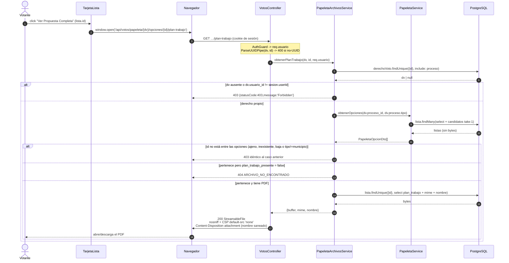

# Design: Rediseño visual de la boleta de votación (3 pasos)

## Enfoque técnico

Cambio **aditivo** sobre dos caminos de LECTURA ya cerrados (`GET /votos/papeleta/:derechoVotoId`
de #14/PR1 y `GET /votos/comprobante/:votoId` de #15/PR3). No se toca `VotosService.emitir()`, la
transacción del voto, ni `schema.prisma`. Tres frentes:

1. `PapeletaOpcionDto` gana campos opcionales homogéneos (D1) y `PapeletaService.obtenerOpciones()`
   los mapea con una sola query por tipo (D2).
2. Dos rutas nuevas de binario en `VotosController`, autorizadas por pertenencia reusando
   `obtenerOpciones()` como fuente única de verdad (D3), más la relajación puntual de
   `GET /configuracion/logo` (D4).
3. Cuatro piezas presentacionales nuevas en `apps/frontend/src/votos/piezas/` y el rediseño de las
   cuatro existentes (D5-D7).

**No requiere ADR nuevo.** Ninguna decisión de arquitectura ya tomada cambia: se respetan ADR-0001
(monolito modular, sin nuevas dependencias entre módulos), ADR-0004 (REST/OpenAPI con tipos de
cliente generados), ADR-0006 §2 (el `eleccion_resumen` sí viaja al votante) y ADR-0010 (el secreto
del voto no se ve afectado: todo lo que se agrega es catálogo público de la papeleta, nunca
elección emitida).

**Corrección de nomenclatura respecto del proposal.** Los "3 pasos" del código son
`PasoInformacionProceso` (1), `PasoBoleta` (2) y `PasoConfirmacion` (3). `PanelComprobante` es
post-emisión (`fase:'exito'`) y además lo reusa `ComprobantePage`: recibe el rediseño visual
(ícono de check, badge) pero **no** la barra de progreso. Las rutas reales de los componentes son
`apps/frontend/src/votos/piezas/*.tsx` (el proposal las lista sin `piezas/`).

## Decisiones de arquitectura

### D1 — `PapeletaOpcionDto`: campos opcionales homogéneos, sin unión discriminada

**Elección**: una sola clase con `@ApiPropertyOptional`, igual que `SegmentacionDto`,
`ListaRespuestaDto` y `CandidatoRespuestaDto`.

**Alternativa rechazada**: unión discriminada (`oneOf` + `discriminator` por un `tipo` propio de
cada opción).

**Fundamento**:
- El discriminante **ya existe en el padre**: `PapeletaProcesoDto.tipo`. Una unión obligaría a
  repetir `tipo` en cada elemento de `opciones[]`, duplicando un dato que el cliente ya usa para
  decidir (`VotacionPage.campoEleccion()`). El estrechamiento en el frontend se hace por
  `datos.proceso.tipo`, no por elemento.
- ADR-0004: `oneOf`/`discriminator` en `@nestjs/swagger` exige `@ApiExtraModels` + `getSchemaPath()`
  manual; el módulo `votos` nunca lo usó y `papeleta.dto.ts` ya documenta un incidente de
  "circular dependency" de `@nestjs/swagger` 8.1 con metadata anidada bajo `tsx`. Un esquema
  polimórfico multiplica ese riesgo en `pnpm openapi:extract`.
- Consistencia de idioma con #11-#13, que es la regla de `rules.apply` ("seguir las convenciones
  existentes").

### D2 — Cabeza de lista: una sola query con `include` + `take: 1` (no N+1)

**Elección**: `lista.findMany` con relación anidada acotada:

```ts
const listas = await this.prisma.lista.findMany({
  where: { proceso_id: procesoId, estado: 'activo' },
  orderBy: { numero: 'asc' },
  select: {
    id: true, nombre: true, simbolo: true, lema: true, propuesta: true, plan_trabajo_mime: true,
    candidatos: {
      where: { estado: 'activo' },
      orderBy: [{ nombres: 'asc' }, { id: 'asc' }],
      take: 1,
      select: { id: true, nombres: true, cargo: true, foto_mime: true },
    },
  },
});
```

**Alternativa rechazada**: un `findFirst` por lista dentro de un `map` (N+1: la latencia escala con
el número de listas, sin cota por request) o `groupBy` (no devuelve columnas no agregadas como
`nombres`/`cargo`, exigiría igualmente una segunda lectura).

**Fundamento**: Prisma compila un `take` en relación anidada a una única consulta con función de
ventana (`ROW_NUMBER() OVER (PARTITION BY lista_id ORDER BY ...)`), no a una consulta por padre —
el costo total es 2 sentencias SQL sea cual sea el número de listas. Detalles:
- `orderBy: [{ nombres: 'asc' }, { id: 'asc' }]`: `nombres` **no es único**; sin desempate por `id`
  el "cabeza de lista" podría variar entre réplicas o entre ejecuciones. El orden `nombres asc` es
  el mismo de `CandidatosService.listar()`.
- **Convención, no dominio**: `Candidato` no tiene campo de orden ni de "principal". Esto es una
  regla de desempate determinística para elegir qué foto mostrar; **no** es una designación real de
  cabeza de lista y así debe documentarse en el código (comentario en `obtenerOpciones()`).
- `select` explícito **nunca incluye `foto`/`plan_trabajo`** (Bytes). `foto_presente` se deriva de
  `foto_mime !== null` y `plan_trabajo_presente` de `plan_trabajo_mime !== null` — invariante
  garantizada porque `CandidatosService`/`ListasService` escriben siempre bytes+mime juntos y los
  limpian juntos. Si la invariante se rompiera, el peor caso es un `` roto (el endpoint de
  archivo revalida los bytes reales y responde 404), nunca un 500.
- Las otras dos ramas ganan `orderBy` explícito: `candidato.findMany` por `nombres asc`,
  `opcionConsulta.findMany` por `etiqueta asc` (hoy no lo tienen).

### D3 — Autorización por pertenencia de los endpoints de archivo

**Elección**: los dos handlers viven en `VotosController` (no en un controlador nuevo) y delegan en
un `PapeletaArchivosService` que **reusa `PapeletaService.obtenerOpciones()`** para decidir la
pertenencia.

**Alternativa rechazada**: un `VotosArchivosController` propio (obligaría a duplicar el
`consumer.apply(cookieParser()).forRoutes(...)` de `VotosModule` y el `@UseGuards(AuthGuard)` de
clase) y una consulta de pertenencia escrita a mano (`candidato.findFirst({ where: { id, lista: {
proceso_id } } })`), que crearía una **segunda definición** de "opción de esta papeleta" capaz de
divergir de la que se renderiza.

**Algoritmo exacto** (idéntico para ambas rutas hasta el paso 4):

1. `ParseUUIDPipe` sobre `derechoVotoId` e `id` → `400` para formato inválido. El formato no es
   existencia: esto no abre un oráculo (mismo criterio que `GET /votos/papeleta/:derechoVotoId`).
2. `derechoVoto.findUnique({ where: { id: derechoVotoId }, include: { proceso: true } })`.
   Si `!dv || dv.usuario_id !== sesion.userId` → `new ForbiddenException()` **sin cuerpo**
   (`{statusCode:403,message:'Forbidden'}`), literalmente el mismo objeto que
   `PapeletaService.obtener()` y `ComprobanteService.obtener()` (D9/D13 de #14).
3. `const opciones = await this.papeletaService.obtenerOpciones(dv.proceso_id, dv.proceso.tipo)`
   (el método pasa de `private` a `public` — sigue sin auditar nada).
4. Resolución de pertenencia:
   - **foto**: `const opcion = opciones.find((o) => o.candidato_id === id)`.
   - **plan-trabajo**: `const opcion = opciones.find((o) => o.id === id && o.plan_trabajo_presente !== undefined)`.
   - Si `!opcion` → `new ForbiddenException()` idéntico al del paso 2. Esto cubre con **una misma
     respuesta**: id inexistente, id de otro proceso, lista/candidato dado de baja, y el caso
     `tipo === 'consulta'` (ninguna opción lleva `candidato_id` ni `plan_trabajo_presente`, así que
     toda petición cae acá sin rama especial).
   - Si existe pero `foto_presente === false` / `plan_trabajo_presente === false` → `404`
     `ARCHIVO_NO_ENCONTRADO`. **No es un oráculo**: el cliente ya recibió ese booleano en la
     papeleta que tiene derecho a leer.
5. **Recién ahora** se leen los bytes: `candidato.findUnique({ where: { id }, select: { foto: true,
   foto_mime: true } })` / `lista.findUnique({ where: { id }, select: { plan_trabajo: true,
   plan_trabajo_mime: true, plan_trabajo_nombre: true } })`. Regla: *autorizar primero, cargar bytes
   después* — una petición denegada nunca materializa un binario en memoria.

**Streaming: se duplica, no se extrae helper.** Las ~8 líneas (`res.set({nosniff, CSP})` +
`new StreamableFile(buffer, {type})`) ya están triplicadas entre `ConfiguracionController`,
`CandidatosController` y `ListasController`, igual que las interfaces locales
`RespuestaConCabeceras`/`ArchivoMulter`: es la convención explícita del proyecto ("shape mínimo
local"). Además la CSP **no es idéntica** (`configuracion` agrega `style-src 'unsafe-inline'` por
los SVG; `votos` sirve PNG/JPEG/PDF y usa `default-src 'none'`), así que un helper tendría que
parametrizar justo lo que varía. Y extraerlo crearía una dependencia `votos → candidatos` que
`VotosModule` (hoy: `AuthModule`, `AuditoriaModule`) evita por ADR-0001. Se difiere hasta un cuarto
consumidor con cabeceras idénticas.

**Mejora deliberada sobre el código copiado**: el `Content-Disposition` del plan de trabajo sanea el
nombre (`plan_trabajo_nombre.replace(/[^\w.\- ]/g, '_')`) antes de interpolarlo. `ListasController`
lo interpola crudo desde `originalname` de multer (riesgo de inyección de cabecera con comillas o
CR/LF); acá la audiencia es cualquier votante. **No** se retro-corrige `ListasController` en este
change: queda como hallazgo para backlog.

### D4 — `GET /configuracion/logo`: el mecanismo del proposal no funciona en NestJS

**Verificado en `apps/backend/src/auth/roles.guard.ts`**: el guard usa
`reflector.getAllAndOverride(ROLES_KEY, [context.getHandler(), context.getClass()])`, que devuelve
el **primer valor `!== undefined`** en ese orden. Un método **sin** `@Roles` propio **sí hereda** el
`@Roles('administrador','director')` de la clase. Y `@UseGuards` a nivel de método es **aditivo**,
no reemplaza los guards de clase: agregar `@UseGuards(AuthGuard)` al método no desactiva el
`RolesGuard` de `ConfiguracionController`. El mecanismo descrito en el proposal sería un no-op
silencioso.

**Elección**: un decorador nombrado nuevo en `auth/roles.decorator.ts`:

```ts
/** Anula un @Roles de clase: metadata definida y vacía -> RolesGuard deja pasar a cualquier
 *  usuario autenticado (contrato ya documentado del guard, D8 de auth-server-sessions). */
export const SinRestriccionDeRol = (): ReturnType<typeof SetMetadata> => SetMetadata(ROLES_KEY, []);
```

aplicado solo a `ConfiguracionController.obtenerLogo()`. `getAllAndOverride` encuentra `[]` en el
handler (definido, gana sobre la clase) y el guard entra por su rama ya existente
`if (!rolesRequeridos || rolesRequeridos.length === 0) return true;`. `AuthGuard` de clase sigue
corriendo → anónimo sigue recibiendo `401`. Se elimina el `@ApiResponse({status:403,...})` de ese
método.

**Alternativas rechazadas**: (a) `@Roles('administrador','director','comite','estudiante','padre',…)`
a nivel de método — funciona hoy pero se rompe en silencio al agregar un rol al enum;
(b) endpoint espejo `GET /votos/logo` — duplica el binario y la ruta por un dato institucional
público, contra la decisión de producto del proposal.

**Consecuencia en el cliente**: `urlLogo(version)` cache-bustea con `logo_actualizado_en`, que viene
de `GET /configuracion` (admin-only). El votante llama `urlLogo()` **sin versión**: un logo cacheado
tras un reemplazo es un desvío puramente cosmético en la portada. Como el endpoint responde `404`
sin logo persistido y el votante no puede leer `logo_presente`, la portada se renderiza siempre y se
oculta con `onError` (manejador de evento + `useState` local; sigue siendo pieza sin efectos).

### D5 — `BarraProgresoVotacion`: cada paso la monta

**Elección**: cada componente de paso la renderiza como primer hijo de su propio contenedor, con el
número fijo por componente. `VotacionPage.tsx` **no cambia** por este punto.

```ts
interface BarraProgresoVotacionProps { pasoActual: number; totalPasos: number; }
// <div role="progressbar" aria-label="Progreso de la votación"
//      aria-valuemin={1} aria-valuemax={totalPasos} aria-valuenow={pasoActual}>
// Texto visible: "Paso {pasoActual} de {totalPasos}" + "{porcentaje}% Completado"
// porcentaje = Math.round((pasoActual / totalPasos) * 100)
```

Montaje: `PasoInformacionProceso` → `1`, `PasoBoleta` → `2`, `PasoConfirmacion` → `3`, `totalPasos`
`3` en los tres. `PanelComprobante`, `PantallaRechazo` y los estados de error **no** la montan.

**Alternativa rechazada**: wrapper compartido en `VotacionPage`. Cada paso ya declara su propio
`<div className="mx-auto w-full max-w-page px-5 md:px-12">`; el wrapper quedaría fuera de esa caja
(desalineado) o duplicaría las clases, necesitaría igualmente un condicional por `estado.fase` para
no aparecer en comprobante/rechazo, y agregaría una prop cuyo único fin es reubicar una constante.
Mantener el número dentro de la pieza conserva a `VotacionPage` como contenedor de estado puro
(D14 de #14).

### D6 — Variantes de tarjeta y preservación de `Seleccion`

`Seleccion` **no cambia**: `{tipo:'opcion'; id} | {tipo:'blanco'}`. **Invariante crítica**: el `id`
seleccionado es siempre `opcion.id` (`Lista.id` / `Candidato.id` / `OpcionConsulta.id`), **nunca**
`candidato_id`. `candidato_id` existe solo para foto y nombre del cabeza de lista; usarlo como id de
selección haría que `campoEleccion('municipio')` enviara un uuid de `Candidato` en `lista_id`, y el
backend lo rechazaría como `ELECCION_INVALIDA`. Debe quedar como comentario en `PasoBoleta`.

**Semántica ARIA preservada**: la grilla mantiene `role="radiogroup" aria-label="Opciones de la
boleta"` y cada tarjeta contiene un `<input type="radio" name="eleccion" className="sr-only">`
dentro de un `<label>`. La acción secundaria ("Ver Propuesta Completa") es un `<button>` **hermano
del `<label>`, dentro del `<div>` de la tarjeta** — así el click en el botón no activa el radio por
propagación de label.

**Alternativa rechazada**: tarjeta como `<button role="radio" aria-checked>`. Obliga a implementar
roving `tabIndex` a mano para cumplir ARIA APG, prohíbe anidar el botón secundario (HTML inválido) y
rompería todas las queries `getByRole('radio')` de `VotacionPage.spec.tsx` sin ganancia funcional.

Selección de variante en `PasoBoleta`, por `tipo` (`PapeletaDto['proceso']['tipo']`), sin heurística
sobre los campos presentes:

| `tipo` | Variante | Datos que muestra |
|---|---|---|
| `municipio` | `TarjetaLista` | `etiqueta`, `simbolo`, `lema`, `propuesta`, foto+`candidato_nombres`+`cargo`, botón si `plan_trabajo_presente` |
| `representante_aula`, `padres` | `TarjetaCandidato` | foto, `etiqueta`, `cargo` |
| `consulta` | `TarjetaOpcion` | `etiqueta` |
| (siempre, además) | `TarjetaVotoBlanco` | Texto fijo, `border-dashed` en el `<label>` |

### D7 — Apertura del plan de trabajo

`window.open(url, '_blank', 'noopener')` sobre la URL construida por `votos-api.urlPlanTrabajo()`
(la cookie de sesión viaja sola en same-origin, mismo criterio que `candidatos-api.urlFoto()`), con
`Content-Disposition: attachment` idéntico al endpoint admin. **Rechazado**: `fetch` → `Blob` →
`URL.createObjectURL`, que metería un ciclo de vida de object URL (y su `revokeObjectURL`) dentro de
una pieza presentacional.

## Flujo de datos

```
VotacionPage (contenedor, único con efectos)
   │  GET /votos/papeleta/:dv ──► PapeletaService.obtener()
   │                                 └─► obtenerOpciones()  [1 query + relación anidada]
   ▼
PasoBoleta (tipo, opciones, derechoVotoId)
   ├─ TarjetaLista ──► 
   │                └─ botón ──► window.open(/votos/papeleta/:dv/opciones/:id/plan-trabajo)
   ├─ TarjetaCandidato ──► 
   ├─ TarjetaOpcion
   └─ TarjetaVotoBlanco
```

### Diagrama de secuencia — "Ver Propuesta Completa" (Paso 2, `municipio`)



## Cambios de archivos

| Archivo | Acción | Descripción |
|---|---|---|
| `apps/backend/src/votos/dto/papeleta.dto.ts` | Modify | `PapeletaOpcionDto` + 8 campos opcionales (D1) |
| `apps/backend/src/votos/papeleta.service.ts` | Modify | `obtenerOpciones()` pasa a `public`, mapeo por tipo, `select`/`orderBy`/`include` (D2) |
| `apps/backend/src/votos/papeleta-archivos.service.ts` | Create | Pertenencia + lectura de bytes (D3) |
| `apps/backend/src/votos/votos.controller.ts` | Modify | 2 rutas nuevas de binario (D3) |
| `apps/backend/src/votos/votos.module.ts` | Modify | Registrar `PapeletaArchivosService` |
| `apps/backend/src/auth/roles.decorator.ts` | Modify | `SinRestriccionDeRol()` (D4) |
| `apps/backend/src/configuracion/configuracion.controller.ts` | Modify | `@SinRestriccionDeRol()` en `obtenerLogo()` (D4) |
| `apps/frontend/src/votos/votos-api.ts` | Modify | `urlFotoOpcion()`, `urlPlanTrabajoOpcion()` |
| `apps/frontend/src/votos/piezas/BarraProgresoVotacion.tsx` | Create | Barra lineal compartida (D5) |
| `apps/frontend/src/votos/piezas/Tarjeta{Lista,Candidato,Opcion,VotoBlanco}.tsx` | Create | Variantes del Paso 2 (D6) |
| `apps/frontend/src/votos/piezas/PasoInformacionProceso.tsx` | Modify | Barra, portada institucional, 3 tarjetas de reglas |
| `apps/frontend/src/votos/piezas/PasoBoleta.tsx` | Modify | Grilla de variantes, `% Completado`, footer (`onVolver`) |
| `apps/frontend/src/votos/piezas/PasoConfirmacion.tsx` | Modify | Solo la barra de progreso (paso 3) |
| `apps/frontend/src/votos/piezas/PanelComprobante.tsx` | Modify | Ícono de check, badge `yaRegistrado` |
| `apps/frontend/src/votos/VotacionPage.tsx` | Modify | Pasa `tipo`/`derechoVotoId`/`onVolver` a `PasoBoleta` |
| `apps/frontend/src/votos/ComprobantePage.tsx` | Modify | `<PanelComprobante yaRegistrado />` |
| `packages/contracts/src/generated/api.ts` | Regenerate | `pnpm openapi:extract` tras D1/D3 |

## Interfaces / Contratos

```ts
// apps/backend/src/votos/dto/papeleta.dto.ts
export class PapeletaOpcionDto {
  @ApiProperty({ type: String }) id!: string;            // Lista | Candidato | OpcionConsulta
  @ApiProperty({ type: String }) etiqueta!: string;

  // --- OpcionConsulta (tipo === 'consulta') ---
  @ApiPropertyOptional({ type: String }) descripcion?: string;

  // --- Lista (tipo === 'municipio') ---
  @ApiPropertyOptional({ type: String })  simbolo?: string;
  @ApiPropertyOptional({ type: String })  lema?: string;
  @ApiPropertyOptional({ type: String })  propuesta?: string;
  @ApiPropertyOptional({ type: Boolean }) plan_trabajo_presente?: boolean;

  // --- Candidato representante de la opción ---
  // municipio: cabeza de lista (convención D2). representante_aula/padres: la opción misma
  // (candidato_id === id). consulta: los cuatro ausentes.
  @ApiPropertyOptional({ type: String })  candidato_id?: string;
  @ApiPropertyOptional({ type: String })  candidato_nombres?: string;
  @ApiPropertyOptional({ type: String })  cargo?: string;
  @ApiPropertyOptional({ type: Boolean }) foto_presente?: boolean;
}
```

Regla del mapper, sin ramas por tipo dentro del bloque de candidato: los cuatro campos de candidato
se emiten juntos siempre que exista un `Candidato` resuelto (`cargo` solo si no es `null`). Para
`municipio` sin candidatos activos, la lista se emite sin ellos y `TarjetaLista` cae a su
placeholder. `OpcionConsulta.descripcion` (si no es `null`) SÍ se agrega — corrección sobre una
lectura literal previa del proposal ("nada adicional para `OpcionConsulta`"): las specs
(`vote-casting`, escenarios de `TarjetaOpcion`) exigen explícitamente "etiqueta y descripción" para
la tarjeta de consulta, y el campo ya existe en `OpcionConsulta.descripcion` (`schema.prisma:279`,
`String?`) sin costo de exposición (es texto público de la consulta, no un dato de secreto de
voto). `TarjetaOpcionProps` (abajo) recibe `descripcion` a través de `opcion.descripcion`.

```
GET /votos/papeleta/{derechoVotoId}/opciones/{id}/foto
    200 image/png|image/jpeg · 400 no-UUID · 401 sin sesión
    403 derecho ajeno/inexistente O id fuera de las opciones (cuerpo idéntico)
    404 pertenece pero sin foto almacenada
GET /votos/papeleta/{derechoVotoId}/opciones/{id}/plan-trabajo
    200 application/pdf · 400 · 401 · 403 (idem) · 404 sin PDF
    Cabeceras (ambas): X-Content-Type-Options: nosniff
                       Content-Security-Policy: default-src 'none'
```

```ts
// Props de las piezas nuevas
interface TarjetaSeleccionableProps { seleccionada: boolean; onSeleccionar: () => void }
interface TarjetaListaProps     extends TarjetaSeleccionableProps { opcion: PapeletaOpcionDto; urlFoto?: string; onVerPropuesta?: () => void }
interface TarjetaCandidatoProps extends TarjetaSeleccionableProps { opcion: PapeletaOpcionDto; urlFoto?: string }
interface TarjetaOpcionProps    extends TarjetaSeleccionableProps { opcion: PapeletaOpcionDto }
type TarjetaVotoBlancoProps = TarjetaSeleccionableProps;

interface PasoBoletaProps {
  opciones: PapeletaOpcionDto[];
  tipo: PapeletaDto['proceso']['tipo'];
  derechoVotoId: string;
  seleccion: Seleccion | undefined;
  onSeleccionar: (s: Seleccion) => void;
  onContinuar: () => void;
  onVolver: () => void;               // VotacionPage: () => irAPaso(1)
}
interface PanelComprobanteProps { comprobante: ComprobanteResumen; yaRegistrado?: boolean }
```

## Estrategia de tests (TDD activo, `rules.apply.tdd: true`)

| Archivo | Acción | Detalle |
|---|---|---|
| `papeleta.service.spec.ts` | Actualizar + agregar | El `toEqual` de `opciones` y el `toHaveBeenCalledWith` de `lista.findMany` cambian (ahora con `select`/`orderBy`/`candidatos`). Casos nuevos: lista sin candidatos activos, desempate `nombres asc` con dos candidatos, `consulta` sin campos extra, `representante_aula` con `candidato_id === id`, y **`select` sin `foto`/`plan_trabajo`** |
| `papeleta-archivos.service.spec.ts` | Crear | 403 derecho ajeno, 403 derecho inexistente, 403 id de otro proceso, 403 id de baja, 403 en `consulta`, **403 byte-a-byte idéntico entre los cinco**, 404 sin binario, 200 feliz, y que los bytes no se leen en los caminos 403 |
| `votos.controller.spec.ts` | Actualizar | Las 2 rutas nuevas: `res.set` con `nosniff` + CSP, `Content-Disposition` saneado, `StreamableFile` con el mime persistido |
| `roles.guard.spec.ts` | Agregar | Handler con `[]` anula `@Roles` de clase → `true`; handler sin metadata hereda la clase → `403` |
| `configuracion.controller.spec.ts` | Agregar | `Reflect.getMetadata(ROLES_KEY, ConfiguracionController.prototype.obtenerLogo)` es `[]` |
| `PasoBoleta.spec.tsx` | **Reescribir** | Cambian props y estructura. Sobreviven las queries `getByRole('radio'|'radiogroup')` y el assert `border-dashed` (D6). Nuevos: variante por `tipo` (3 casos), "Ver Propuesta Completa" solo con `plan_trabajo_presente`, click en el botón secundario **no** cambia la selección, `onVolver` |
| `VotacionPage.spec.tsx` | **Solo fixtures** | `papeletaMock` gana campos opcionales; ningún `findByRole('radiogroup')`/`getByRole('radio')` cambia. Un test nuevo: volver de paso 2 a paso 1 |
| `PanelComprobante.spec.tsx` | Agregar | Badge visible con `yaRegistrado`, ausente sin él; los 2 tests existentes siguen válidos |
| `BarraProgresoVotacion.spec.tsx`, `Tarjeta*.spec.tsx` | Crear | `role="progressbar"` + `aria-valuenow`; una spec por variante |

Verificación de branding (Success Criteria): `rg -i "san alfonso" apps/` debe salir vacío.

## Threat Matrix

| Límite | Casos adversarios mínimos | Aplicabilidad | Respuesta de diseño | Tests RED planificados |
|---|---|---|---|---|
| IDOR / enumeración | `:id` de otro proceso, de una opción dada de baja, inexistente, `derechoVotoId` ajeno | **Aplicable** | `403` sin cuerpo discriminante, idéntico en los 4 casos; pertenencia derivada de `obtenerOpciones()` | `papeleta-archivos.service.spec.ts` (5 casos + comparación de cuerpos) |
| Enrutamiento (servidor) | Colisión con `@Get('papeleta/:derechoVotoId')`, params no-UUID | **Aplicable** | Distinto número de segmentos → sin ambigüedad; `ParseUUIDPipe` en ambos params antes del handler | `votos.controller.spec.ts` (400 no-UUID en ambos params) |
| Clasificación de archivo activo | SVG con `<script>` servido como foto, PDF con JavaScript embebido, `Content-Disposition` con comillas/CRLF en el nombre | **Aplicable** | `nosniff` + `default-src 'none'` en toda respuesta; `filename` saneado con `[^\w.\- ]→_`; `@ApiProduces` restringido | `votos.controller.spec.ts` (cabeceras presentes; nombre con comillas queda saneado) |
| Autorización por metadata | Un `@Roles` de clase que el método pretende anular | **Aplicable** | `SetMetadata(ROLES_KEY, [])` en el handler (D4); el resto del controlador intacto | `roles.guard.spec.ts` + `configuracion.controller.spec.ts` |
| Enrutamiento (cliente) | Paso 2 recargado o enlazado directo | N/A: el paso sigue siendo estado del contenedor, no URL (#14 D14) — este change no lo toca | — | — |
| Rutas tipo documentación | `requirements.txt`, Markdown ejecutable | N/A: no se clasifica ni ejecuta ningún archivo del repositorio | — | — |
| Selección de repositorio Git / estado de commit / push / comandos de PR | `git -C`, índice vacío, refspec explícito | N/A: sin automatización de VCS/PR ni subprocesos en este change | — | — |

## Migración / Despliegue

Sin migración: cero cambios en `schema.prisma`. Todos los campos nuevos del DTO son opcionales, así
que un cliente viejo contra un backend nuevo sigue funcionando. Orden de despliegue obligatorio:
backend (DTO + rutas) → `pnpm openapi:extract` → frontend, porque las piezas nuevas se tipan contra
`packages/contracts` regenerado. Rollback: `git revert` de los commits del change (ver proposal).

## Preguntas abiertas

- [ ] `Lista.numero` (p. ej. "Lista N.º 3") existe en el schema y es habitual en el encabezado de
      una tarjeta de lista, pero el proposal no lo incluye entre los campos nuevos. Se dejó **fuera**
      del DTO por disciplina de alcance. ¿Se agrega como `numero?: number`? Es aditivo y de costo
      nulo (ya se lee para el `orderBy`).
- [ ] `cargo` se emite también para el cabeza de lista en `municipio` (subproducto de la regla
      uniforme del mapper). El proposal solo lo pedía para `representante_aula`/`padres`. Confirmar
      que `sdd-spec` lo cubra o quitarlo.
