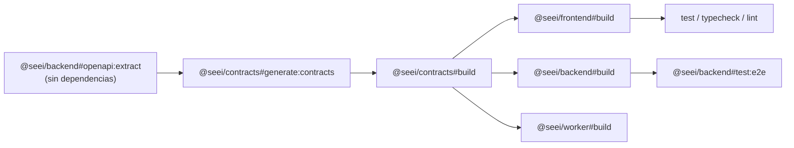
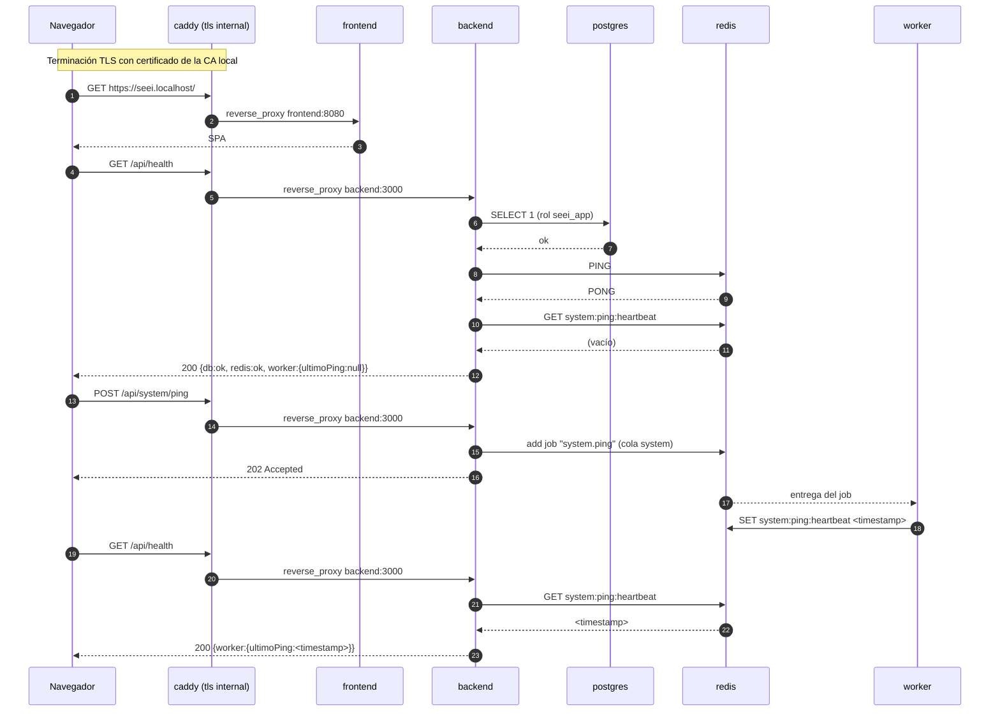

# Diseño: system-scaffolding (Backlog #1 — Andamiaje del sistema)

Este documento convierte las decisiones ya cerradas en la propuesta (pnpm + Turborepo, distribución
de paquetes, Jest/Vitest, Caddy con `tls internal`, GitHub Actions, dos roles de PostgreSQL) en una
arquitectura ejecutable. No vuelve a discutir esas elecciones: resuelve el nivel que la propuesta
dejó abierto.

## Enfoque técnico

Un monorepo pnpm con un grafo de tareas de Turborepo donde el contrato OpenAPI es un **artefacto
generado y versionado**, no un paso manual. El backend emite el documento OpenAPI sin levantar
servidor; `packages/contracts` lo transforma en tipos; el frontend y los tests e2e del backend lo
consumen. CI regenera y compara, de modo que la deriva silenciosa que el ADR-0004 nombra como costo
real se convierte en un fallo de build determinista.

La topología local reproduce la de producción (ADR-0007): un único punto de entrada TLS (Caddy),
red interna cerrada, y PostgreSQL con dos roles separados desde el primer día.

## Resumen de decisiones

| # | Decisión | Alternativas descartadas | Fundamento |
|---|---|---|---|
| D1 | `openapi:extract` corre desde el código fuente TS con `tsx`, sin `listen()` y sin dependencias de tarea | Levantar la app y consultar `/api/docs-json`; extraer desde `dist/` | Evita el ciclo `build → contracts → backend#build` y elimina la necesidad de Postgres/Redis vivos solo para emitir un JSON |
| D2 | `openapi-typescript` + `openapi-fetch` como generadores | `orval` (genera hooks de React Query, prematuro); `openapi-generator` (toolchain Java) | Salida mínima y determinista, cero runtime pesado; React Query es alcance del ADR-0005, no de este ítem |
| D3 | El contrato generado se versiona en git y CI verifica deriva con `git status --porcelain` | `git diff --exit-code` a secas | `git diff` no detecta archivos **no rastreados**: un endpoint nuevo generaría un archivo nuevo y el check pasaría en falso (ver Matriz de amenazas) |
| D4 | Dos archivos compose: base sin puertos publicados salvo Caddy, `.dev.yml` aditivo | Un solo compose con perfiles | ADR-0007 exige que DB y Redis nunca se expongan; un archivo base que ya es seguro por omisión no puede filtrar comodidad de desarrollo |
| D5 | `seei_migrator` es propietario del esquema; `seei_app` recibe DML por `ALTER DEFAULT PRIVILEGES` | Un solo rol propietario; `GRANT` explícito tabla por tabla en cada migración | Deja el ítem #3 como un `REVOKE` aditivo de una línea, sin cambio de infraestructura |
| D6 | El servicio one-shot `migrate` aplica migraciones antes de arrancar `backend` | Migrar dentro del entrypoint del backend | Separa físicamente el rol DDL del proceso de runtime; el backend nunca ve la cadena del migrador |
| D7 | El trabajo `system.ping` se dispara con `POST /api/system/ping` y se observa en `GET /api/health` | Encolarlo en el arranque del backend; encolarlo dentro de `/health` | Hace el ida y vuelta observable y determinista en un test e2e, sin acoplar el health check a una escritura |

## Grafo de tareas de Turborepo



**El ciclo y cómo se rompe.** `packages/contracts` se genera a partir de `apps/backend`, pero
`apps/backend` consume `packages/contracts` en sus tests e2e. Si `openapi:extract` dependiera de
`^build`, el grafo sería circular. La regla que lo evita: **`openapi:extract` declara
`dependsOn: []` y se ejecuta sobre TypeScript fuente vía `tsx`**. El código de producción del
backend nunca importa `@seei/contracts` (solo lo hacen sus tests), así que la extracción no
necesita nada compilado.

```jsonc
// turbo.json (Turborepo 2.x usa "tasks", no "pipeline")
{
  "$schema": "https://turbo.build/schema.json",
  "globalDependencies": ["tsconfig.base.json", "pnpm-lock.yaml"],
  "globalEnv": ["NODE_ENV"],
  "tasks": {
    "openapi:extract":  { "dependsOn": [], "inputs": ["src/**", "package.json"], "outputs": ["dist-openapi/openapi.json"] },
    "generate:contracts": { "dependsOn": ["@seei/backend#openapi:extract"], "outputs": ["openapi.json", "src/generated/**"] },
    "@seei/contracts#build": { "dependsOn": ["generate:contracts", "^build"], "outputs": ["dist/**"] },
    "build":     { "dependsOn": ["^build"], "outputs": ["dist/**"] },
    "typecheck": { "dependsOn": ["^build"] },
    "lint":      {},
    "test":      { "dependsOn": ["^build"], "outputs": ["coverage/**"] },
    "test:e2e":  { "dependsOn": ["^build"], "cache": false,
                   "env": ["DATABASE_URL", "MIGRATION_DATABASE_URL", "REDIS_URL"] },
    "db:migrate":{ "cache": false, "env": ["MIGRATION_DATABASE_URL"] },
    "dev":       { "cache": false, "persistent": true }
  }
}
```

| Tarea | ¿Se cachea? | Motivo |
|---|---|---|
| `openapi:extract`, `generate:contracts`, `build`, `test`, `lint`, `typecheck` | Sí | Entradas y salidas deterministas y declaradas |
| `test:e2e`, `db:migrate` | No | Efectos sobre servicios externos; un acierto de caché ocultaría una migración no aplicada |
| `dev` | No (`persistent`) | Proceso de larga duración |

`generate:contracts` lee un archivo fuera de su paquete (`apps/backend/dist-openapi/openapi.json`).
Eso es correcto en Turborepo porque el hash de una tarea incluye el hash de las tareas declaradas en
su `dependsOn`: si el backend cambia, la generación se invalida.

## Generación del contrato OpenAPI

### Extracción (sin levantar servidor)

`apps/backend/src/openapi.ts`, ejecutado con `tsx`:

1. `NestFactory.create(AppModule, { logger: false })`
2. `SwaggerModule.createDocument(app, config)`
3. `writeFileSync('dist-openapi/openapi.json', JSON.stringify(document, null, 2))`
4. `await app.close()` — **nunca `app.listen()`**

**Gotcha obligatorio de implementar:** `NestFactory.create()` ejecuta los hooks `onModuleInit`. Si
`PrismaService` o el cliente Redis abren conexión ahí, la extracción exigiría Postgres y Redis vivos
en CI. Por eso ambos se configuran **perezosos**: `PrismaService` no llama `$connect()` en
`onModuleInit` (Prisma conecta en la primera consulta) e `ioredis` se instancia con
`lazyConnect: true`. Esto también es mejor práctica de arranque, no solo una concesión al build.

### Transformación

`packages/contracts` ejecuta `openapi-typescript` sobre el JSON y emite `src/generated/api.d.ts`
(solo tipos, cero runtime). Sobre eso, un cliente delgado escrito a mano en `src/client.ts` usando
`openapi-fetch`. Consumidores: `apps/frontend` (página de health) y los tests e2e de
`apps/backend`, para que la deriva rompa la compilación en ambos lados a la vez (ADR-0004).

### Verificación de deriva en CI

```bash
pnpm turbo run generate:contracts --force
git add --intent-to-add -- packages/contracts
git diff --exit-code -- packages/contracts \
  || { echo "Contrato desactualizado: ejecute 'pnpm turbo run generate:contracts' y commitee."; exit 1; }
```

`--force` evita que un acierto de caché convierta el check en un no-op. `git add --intent-to-add`
es lo que hace visible un archivo generado **nuevo** ante `git diff`; sin ese paso el check pasa en
falso ante el primer endpoint agregado.

## Diagrama de secuencia del walking skeleton



El trabajo `system.ping` **no toca PostgreSQL**. El heartbeat vive en una clave de Redis, no en una
tabla. Esto lo mantiene libre de esquema y evita que quien implemente #12/#15 lo confunda con
andamiaje del outbox del ADR-0012 (donde la fuente de verdad es una tabla de PostgreSQL escrita en
la misma transacción que el hecho notificado — una semántica deliberadamente distinta).

## Topología de Docker Compose

`infra/docker/docker-compose.yml` — base, con forma de producción. Red única `seei` (bridge).

| Servicio | Imagen / build | Puertos publicados | Healthcheck | Depende de |
|---|---|---|---|---|
| `caddy` | `caddy:2-alpine` | `80`, `443`, `443/udp` | — | `backend`, `frontend` |
| `frontend` | `frontend.Dockerfile` (multi-stage, etapa final sirve `dist` estático en `:8080`) | ninguno | HTTP `:8080` | — |
| `backend` | `backend.Dockerfile` | ninguno | `node -e "fetch('http://localhost:3000/api/health').then(r=>process.exit(r.ok?0:1))"` | `migrate` (completado), `postgres`, `redis` (sanos) |
| `worker` | `worker.Dockerfile` | ninguno | — (sin superficie HTTP; se documenta la omisión) | `redis` (sano) |
| `migrate` | reutiliza `backend.Dockerfile`; `command: pnpm prisma migrate deploy`; `restart: "no"` | ninguno | — | `postgres` (sano) |
| `postgres` | `postgres:16-alpine` | ninguno | `pg_isready -U postgres -d seei` | — |
| `redis` | `redis:7-alpine` | ninguno | `redis-cli ping` | — |

Volúmenes nombrados: `pgdata`, `redisdata`, `caddy_data`, `caddy_config`.

`infra/docker/docker-compose.dev.yml` — **solo aditivo**, nunca reescribe el endurecimiento:

- publica `127.0.0.1:5432:5432` y `127.0.0.1:6379:6379` (herramental local: `psql`, Prisma Studio)
- bind mounts de recarga en caliente para `backend`, `frontend`, `worker`
- `frontend` cambia a la etapa `dev` del Dockerfile y corre el servidor de Vite en el mismo `:8080`,
  de modo que el `Caddyfile` no necesita ramificarse entre desarrollo y producción
- `NODE_ENV=development`

La invocación de desarrollo se encapsula en un script (`pnpm compose:dev`) porque requiere ambos
archivos:
`docker compose -f infra/docker/docker-compose.yml -f infra/docker/docker-compose.dev.yml up`.

`Caddyfile` (un solo sitio, sin ramas):

```caddyfile
seei.localhost {
    tls internal
    handle /api/* { reverse_proxy backend:3000 }
    handle        { reverse_proxy frontend:8080 }
}
```

El backend fija `app.setGlobalPrefix('api')`, así que frontend y API comparten origen — condición
necesaria para que la cookie `httpOnly` + `Secure` del ADR-0004 se pueda ejercitar tal cual en el
ítem #4.

## Modelo de roles de PostgreSQL

Aprovisionamiento en `infra/docker/postgres/init/01-roles.sql`, ejecutado por el entrypoint de la
imagen oficial (`/docker-entrypoint-initdb.d`) contra `POSTGRES_DB=seei`, con el superusuario de
bootstrap `postgres` (que ninguna aplicación usa jamás).

| Rol | Privilegios | Usado por |
|---|---|---|
| `seei_migrator` | Propietario de la base `seei` y del esquema `public`; DDL completo | `prisma migrate deploy` / `dev`, servicio `migrate`, job de CI |
| `seei_app` | `CONNECT`, `USAGE` en `public`, y `SELECT/INSERT/UPDATE/DELETE` + `USAGE, SELECT` en secuencias **por privilegios por defecto**; sin `CREATE` | `backend` y `worker` en runtime |

```sql
CREATE ROLE seei_migrator LOGIN PASSWORD :'migrator_password';
CREATE ROLE seei_app      LOGIN PASSWORD :'app_password';

ALTER DATABASE seei OWNER TO seei_migrator;
ALTER SCHEMA public OWNER TO seei_migrator;
REVOKE ALL ON SCHEMA public FROM PUBLIC;

GRANT CONNECT ON DATABASE seei TO seei_app;
GRANT USAGE   ON SCHEMA public TO seei_app;

-- Clave: todo objeto que cree seei_migrator queda accesible para seei_app sin GRANT manual
ALTER DEFAULT PRIVILEGES FOR ROLE seei_migrator IN SCHEMA public
  GRANT SELECT, INSERT, UPDATE, DELETE ON TABLES TO seei_app;
ALTER DEFAULT PRIVILEGES FOR ROLE seei_migrator IN SCHEMA public
  GRANT USAGE, SELECT ON SEQUENCES TO seei_app;
```

**Terreno preparado para el ítem #3.** Como `seei_app` recibe DML por privilegios por defecto y no
por propiedad, revocar la escritura sobre la tabla de auditoría es una migración aditiva de una
línea (`REVOKE UPDATE, DELETE ON "EventoAuditoria" FROM seei_app;`) más los triggers del ADR-0003.
Este change **no** escribe esa revocación.

### Cadenas de conexión

| Variable | Rol | Consumidor | Origen en desarrollo | Origen en CI |
|---|---|---|---|---|
| `DATABASE_URL` | `seei_app` | Prisma Client (backend, worker) | `infra/docker/.env` (a partir de `.env.example`) | `env` del job, contra el service container |
| `MIGRATION_DATABASE_URL` | `seei_migrator` | `prisma migrate`, servicio `migrate` | ídem | ídem |

`apps/backend/prisma/schema.prisma`:

```prisma
datasource db {
  provider  = "postgresql"
  url       = env("DATABASE_URL")           // Prisma Client → rol de runtime
  directUrl = env("MIGRATION_DATABASE_URL") // Prisma Migrate → rol propietario
}
```

`directUrl` es el mecanismo documentado de Prisma para que Migrate/Introspect usen una conexión
distinta de la del Client. **Contingencia verificable:** si en la versión fijada de Prisma la tarea
de migración no toma `directUrl`, el script `db:migrate` se invoca con la variable sustituida
(`DATABASE_URL=$MIGRATION_DATABASE_URL prisma migrate deploy`). Esta rama se decide con una
comprobación real durante `sdd-apply`, no por supuesto.

`.env.example` versionado (nunca secretos reales) declara `POSTGRES_PASSWORD`,
`SEEI_MIGRATOR_PASSWORD`, `SEEI_APP_PASSWORD`, `DATABASE_URL`, `MIGRATION_DATABASE_URL`,
`REDIS_URL`. El despliegue real toma ambas URL de secretos del entorno de GitHub; CI usa
contraseñas descartables en texto plano porque la base es efímera.

**Gotcha operativo a documentar:** el directorio `docker-entrypoint-initdb.d` solo se ejecuta cuando
el volumen `pgdata` está vacío. Modificar `01-roles.sql` exige `docker compose down -v`.

## Confianza de la CA local de Caddy

`tls internal` emite certificados desde una CA local que Caddy persiste en el volumen `caddy_data`.
Sin confiar esa CA, el navegador advierte, la SPA no puede llamar a `/api`, y las cookies `Secure`
se comportan de forma anómala — que es exactamente el fallo que el riesgo de la propuesta anticipa
como mal diagnosticado.

Paso único de onboarding, encapsulado en `pnpm caddy:trust`:

```bash
docker compose cp caddy:/data/caddy/pki/authorities/local/root.crt ./caddy-local-root.crt
```

| Sistema | Comando |
|---|---|
| Windows | `certutil -addstore -f "ROOT" caddy-local-root.crt` (consola con privilegios de administrador) |
| macOS | `sudo security add-trusted-cert -d -r trustRoot -k /Library/Keychains/System.keychain caddy-local-root.crt` |
| Linux | copiar a `/usr/local/share/ca-certificates/` y ejecutar `sudo update-ca-certificates` |

Firefox mantiene su propio almacén de confianza: requiere importar el certificado por separado.
`seei.localhost` resuelve a `127.0.0.1` en los navegadores modernos (RFC 6761); si el resolutor del
sistema no lo hace, se agrega la entrada al archivo `hosts`.

Documentación: sección `## HTTPS local` en `README.md`, referenciada desde `docs/onboarding.md`.

## Estrategia de testing

| Paquete | Runner | Configuración | Comando |
|---|---|---|---|
| `apps/backend` (unitario) | Jest + ts-jest | `apps/backend/jest.config.ts` | `pnpm --filter @seei/backend test` |
| `apps/backend` (e2e) | Jest + Supertest | `apps/backend/test/jest-e2e.config.ts` | `pnpm --filter @seei/backend test:e2e` |
| `apps/frontend` | Vitest + RTL (jsdom) | bloque `test` en `apps/frontend/vite.config.ts` | `pnpm --filter @seei/frontend test` |
| `apps/worker` | Vitest (entorno node) | `apps/worker/vitest.config.ts` | `pnpm --filter @seei/worker test` |
| `packages/contracts` | Vitest (solo para el cliente escrito a mano) | `vitest.config.ts` | `pnpm --filter @seei/contracts test` |
| Raíz | — | — | `pnpm turbo run test` |

**Coexistencia de Jest y Vitest.** No existe configuración de test en la raíz ni binario de test
raíz: cada paquete declara su propio runner como devDependency y su propia configuración. El
`node_modules` estricto y sin hoisting de pnpm impide que Vitest quede resoluble desde el backend o
viceversa. Para evitar la colisión de tipos ambientales entre `@types/jest` y los globales de
Vitest, **Vitest se usa sin `globals: true`**: los tests importan `describe`/`it`/`expect` desde
`vitest` explícitamente, y cada `tsconfig.json` declara su propio `types`.

**Postgres y Redis efímeros para los e2e del backend.**

- Local: `infra/docker/docker-compose.test.yml` levanta únicamente `postgres` y `redis` en puertos
  alternos (`5433`/`6380`) con el directorio de datos en `tmpfs`. El script `test:e2e` hace
  `up -d --wait` → `prisma migrate deploy` → Jest → `down -v`.
- CI: `services:` containers de GitHub Actions con `--health-cmd`, sin compose. Los mismos nombres
  de variables de entorno, de modo que la suite no distingue el entorno.
- Descartado: `testcontainers-node` (agrega una dependencia y complejidad de Docker-in-CI para el
  mismo resultado) y mockear la base (no probaría la cañería, que es el propósito del ítem).

La suite e2e ejercita **la división de roles**: migra con `MIGRATION_DATABASE_URL` y la aplicación
bajo prueba se conecta con `DATABASE_URL`. Si los privilegios por defecto estuvieran mal, los e2e
fallan.

**TDD estricto** (configuración global): cada línea del walking skeleton —controlador de health,
endpoint de ping, procesador del worker, página de health— se escribe RED → GREEN → REFACTOR, aunque
`coverage_threshold` quede en 0.

## Workflow de GitHub Actions

`.github/workflows/ci.yml` — disparadores `push` a `main` y `pull_request`;
`permissions: contents: read`; `concurrency` por rama con cancelación de ejecuciones superadas.

| Orden | Job | Pasos | Servicios |
|---|---|---|---|
| 1 | `build-and-check` | checkout → `pnpm/action-setup` → `setup-node` (`cache: pnpm`) → `pnpm install --frozen-lockfile` → `turbo run generate:contracts --force` → **verificación de deriva** → `turbo run lint typecheck build test` | ninguno |
| 2 | `e2e-backend` (`needs: build-and-check`) | checkout → install → `prisma migrate deploy` (rol `seei_migrator`) → `turbo run test:e2e --filter=@seei/backend` | `postgres:16`, `redis:7` |

**La verificación de deriva corre inmediatamente después de generar y antes de `build`/`test`.**
Fundamento: si corriera después del build, un contrato divergente fallaría primero como un error de
tipos en el frontend —un mensaje confuso a varios pasos de la causa— en lugar del mensaje explícito
"regenere el contrato". Además falla rápido y ahorra el resto del pipeline.

`.turbo` se cachea con `actions/cache`. No se configura caché remota de Turborepo en este ítem (no
se asume ninguna cuenta de proveedor).

## Cambios de archivos

| Ruta | Acción | Descripción |
|---|---|---|
| `package.json`, `pnpm-workspace.yaml`, `turbo.json`, `tsconfig.base.json`, `.gitignore` | Crear | Raíz del workspace y grafo de tareas |
| `apps/backend/**` | Crear | Bootstrap de NestJS, `HealthModule`, `SystemPingController`, `src/openapi.ts`, Prisma (datasource/generator + migración baseline vacía), Jest |
| `apps/frontend/**` | Crear | Bootstrap de Vite + React, página de health que consume el cliente generado, Vitest + RTL |
| `apps/worker/**` | Crear | Bootstrap de Node, procesador BullMQ `system.ping` con nota doc-comment de no reutilización, Vitest |
| `packages/contracts/**` | Crear | Script de generación, `openapi.json` y `src/generated/api.d.ts` versionados, `src/client.ts` |
| `infra/docker/{backend,frontend,worker}.Dockerfile` | Crear | Imágenes multi-stage por aplicación |
| `infra/docker/docker-compose{,.dev,.test}.yml`, `Caddyfile`, `.env.example` | Crear | Topología local y de prueba |
| `infra/docker/postgres/init/01-roles.sql` | Crear | Aprovisionamiento de `seei_migrator` y `seei_app` |
| `.github/workflows/ci.yml` | Crear | Pipeline de CI |
| `README.md`, `docs/onboarding.md` | Crear | Setup, `pnpm caddy:trust`, gotcha de `down -v` |
| `openspec/config.yaml` | Modificar | `testing.status: available`, `test_command`/`build_command` en `testing`, `apply`, `verify` |

## Contratos e interfaces

```ts
// GET /api/health — 200
interface RespuestaHealth {
  estado: 'ok' | 'degradado';
  db: { estado: 'ok' | 'error'; latenciaMs: number };
  redis: { estado: 'ok' | 'error'; latenciaMs: number };
  worker: { ultimoPing: string | null }; // ISO 8601, leído de system:ping:heartbeat
}
// POST /api/system/ping — 202, cuerpo vacío. Encola "system.ping". Cero acoplamiento a la base.
```

Ambos se declaran con decoradores de `@nestjs/swagger`, que es lo que los hace aparecer en el
documento OpenAPI y, por transitividad, en los tipos generados.

## ADR propuestos (aditivos, no contradicen ninguno existente)

Este diseño no contradice los ADR 0001–0013. Sí introduce dos decisiones duraderas que ningún ADR
cubre todavía; se proponen para redactarse durante la implementación de este change:

| ADR propuesto | Decisión | Por qué merece un ADR |
|---|---|---|
| ADR-0014 | Monorepo TypeScript con pnpm workspaces + Turborepo, contrato OpenAPI como artefacto generado y versionado | El ADR-0002 fija lenguaje y frameworks, no el herramental de build; esta decisión condiciona los 22 ítems restantes |
| ADR-0015 | Separación de roles de PostgreSQL: `seei_migrator` (propietario/DDL) y `seei_app` (runtime, DML por privilegios por defecto) | El ADR-0003 menciona "un rol de aplicación sin permisos de modificación" pero no el rol propietario ni el mecanismo; el ítem #3 depende directamente de esta forma |

## Matriz de amenazas

Aplicable de forma acotada: la verificación de deriva ejecuta comandos de `git` dentro de CI.

| Límite | Casos adversariales mínimos | Aplicabilidad | Respuesta de diseño | Tests RED planificados |
|---|---|---|---|---|
| Rutas con apariencia de documentación | `requirements.txt`, Markdown ejecutable | N/A: este change no clasifica ni ejecuta archivos por su extensión | — | — |
| Selección de repositorio git | rutas relativas vs. absolutas, `git -C` | **Aplicable** | El check corre en el workspace de CI con pathspec explícito `-- packages/contracts`; nunca sobre el árbol completo, para que un artefacto ajeno sucio no produzca un fallo o un aprobado engañoso | Un test del script de verificación con un archivo sucio fuera de `packages/contracts`: debe pasar |
| Estado del índice | archivos staged, no rastreados, índice vacío | **Aplicable** | `git diff --exit-code` **no ve archivos no rastreados**; el script ejecuta `git add --intent-to-add -- packages/contracts` antes de comparar | Un test que agrega un endpoint nuevo (genera un archivo nuevo, no rastreado): el check debe fallar |
| Estado del push | rama de seguimiento, primer push, refspec explícito | N/A: CI no hace push ni escribe en el repositorio | — | — |
| Comandos de PR | `--head`, comandos compuestos | N/A: no hay automatización de PR en este change | — | — |

## Migración y despliegue

No hay migración de datos: una única migración baseline vacía de Prisma que solo demuestra que el
mecanismo funciona de extremo a extremo. Sin feature flags ni despliegue por fases. El rollback es
el de la propuesta: `git revert` del o los PR más `docker compose down -v`.

Este change excede el presupuesto de revisión de 400 líneas. La propuesta esbozó cinco slices
(A herramental, B backend, C frontend/contratos, D worker, E compose/CI). El grafo de tareas de este
diseño impone una restricción sobre cualquier corte: **`packages/contracts` no puede compilar antes
de que exista `apps/backend/src/openapi.ts`**, por lo que el slice del backend precede al de
contratos/frontend. La decisión final del corte corresponde a `sdd-tasks`.

## Preguntas abiertas

- [ ] Verificar durante `sdd-apply` que la versión fijada de Prisma efectivamente usa `directUrl`
      para `migrate deploy`; si no, aplicar la contingencia de sustitución de variable ya descrita.
- [ ] Confirmar que la serialización del documento de `@nestjs/swagger` es estable entre
      ejecuciones con versiones fijadas; si el orden de claves variara, el check de deriva sería
      inestable y habría que normalizar el JSON antes de comparar.
- [ ] El servicio `worker` no expone healthcheck. Aceptado para el andamiaje; revisar cuando el
      despachador del outbox (ADR-0012) llegue en el ítem #12.
